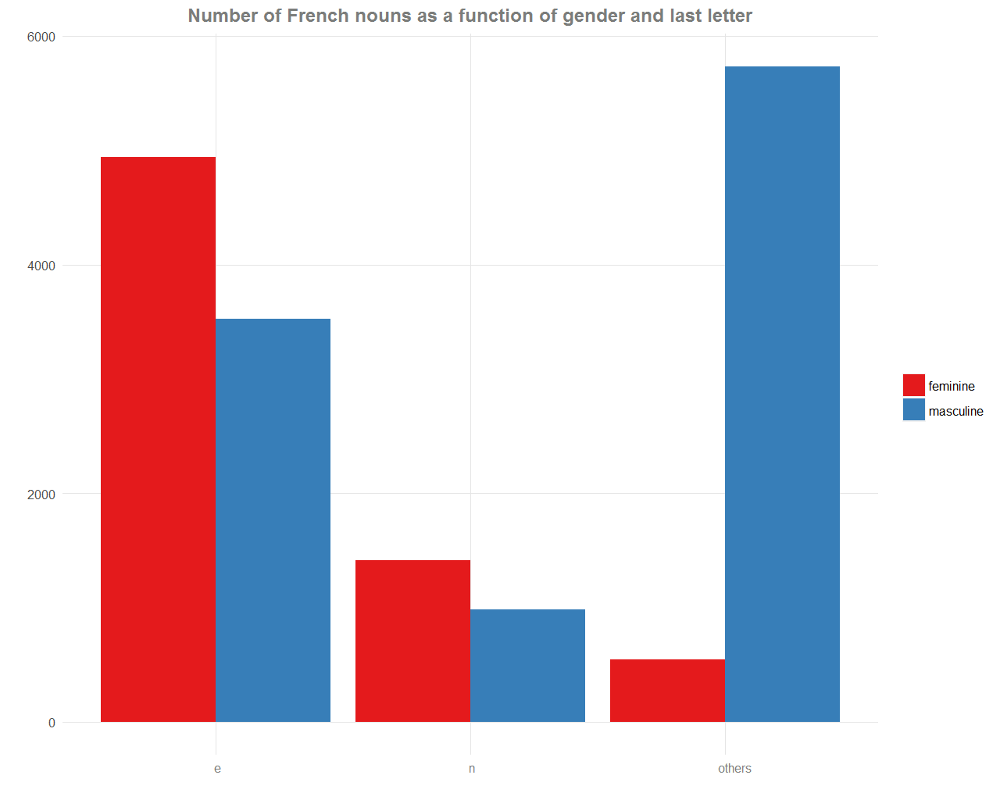
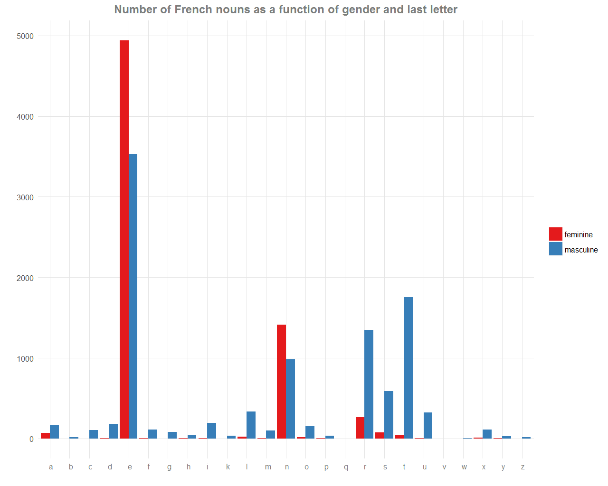
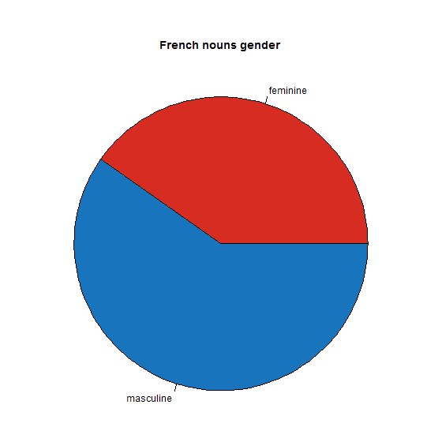

# Gender of French nouns

Like other Romance languages, French nouns are divided in two almost distinct genders: feminine and masculine. Deciding the gender of a word is not obvious. For example, a table is feminine (“une table”) but an acid is masculine (“un acide”).

The code loads a dictionary and represents with bar plots the distribution of the gender across the letters.

You can check out the related blog post here: https://ahstat.github.io/Gender-french-nouns/ or directly see results in the `outputs` folder.

*Number of French nouns as a function of gender and last letter*

The main plot is the following one, giving a simple tip to choose the gender of an unknown noun: Most of nouns which are not ending by 'e' or 'n' are masculine.

 

Here is the same plot, but for all ending letters, 
 

---

*Pie chart of the repartition of the gender*

 